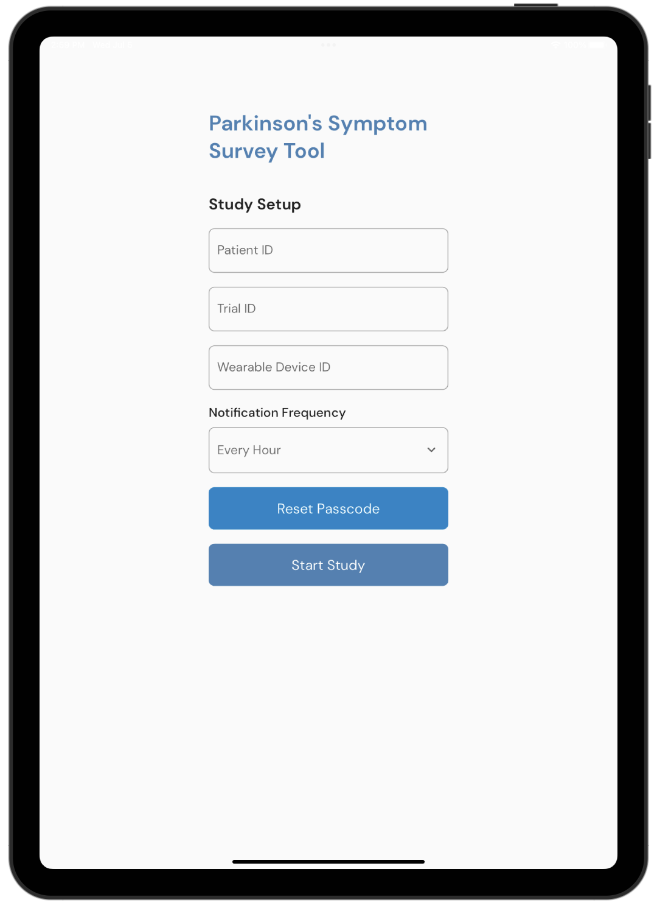
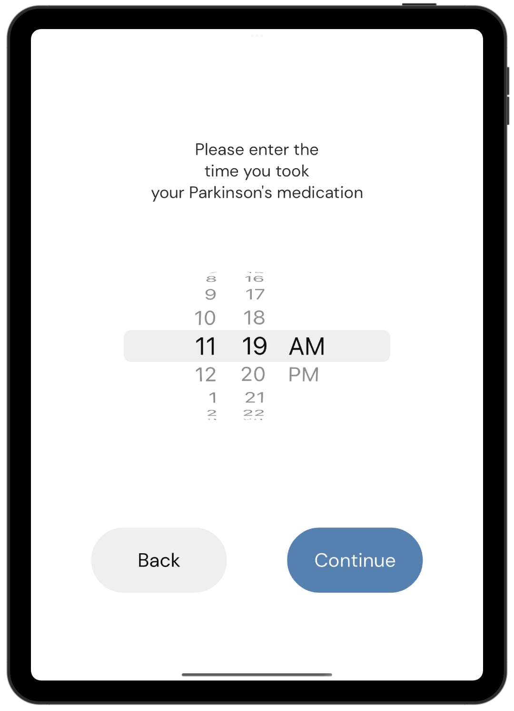
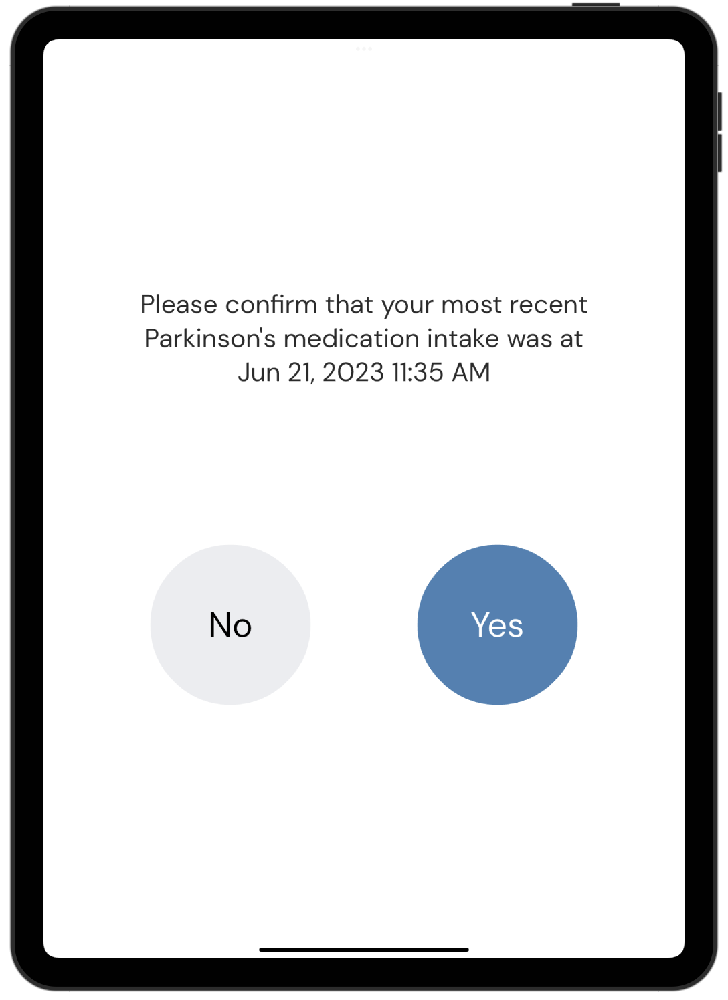
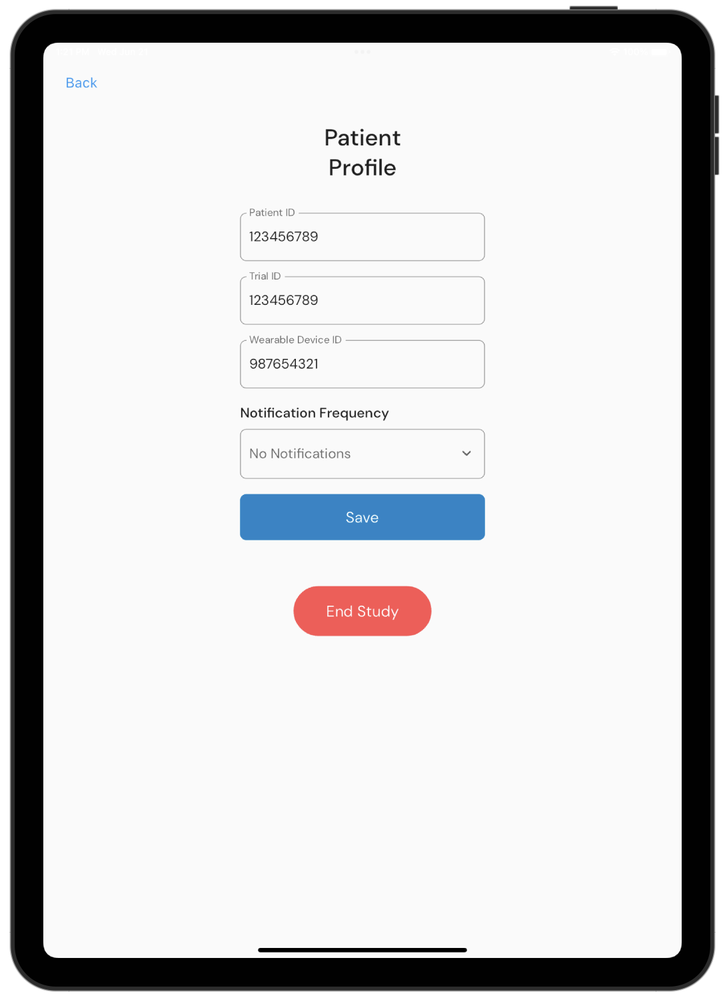

# Parkinson's Symptom Survey App
Start by following the instructions [here](https://github.com/UBC-CIC/balance-test-dashboard/blob/main/docs/DeploymentGuide.md) to deploy the backend and web dashboard of the Balance Test project. The Balance Test Mobile App allows you to record IMU sensor data during Balance Test movements and view statistics and analytics of previously recorded tests. 

|Index| Description|
|:----------------|:-----------|
| [Screenshots](#screenshots)         |     View screenshots of the application.    |
| [Deployment](#deployment-guide)         |    Learn how to deploy this project yourself. |
| [User Guide](#user-guide)         |    Learn how to use this application. |
| [Changelog](#changelog)         |    Any changes post publish |
| [Credits](#credits)         |    Meet the team behind the solution |
| [License](#license)      |     License details.     |

# Screenshots

## Study Setup

  

## Recording Symptoms

  
  

## Recording Medication

  
  

## Admin Page

  

# Deployment Guide

To deploy this solution, please follow our [Deployment Guide](docs/DeploymentGuide.md).

# User Guide

For instructions on how to use the mobile app, refer to the [User Guide](docs/UserGuide.md).

# Changelog

View the changelog [here](/docs/Changelog.md)

# Credits

This application was architected and developed by Timothy Jin, with guidance from the UBC CIC technical and project management teams.

# License

This project is distributed under the [MIT License](./LICENSE).
