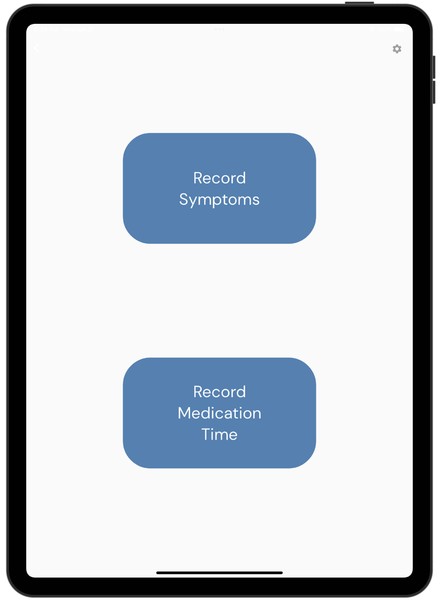

# Parkinson's Symptom Survey App

The Parkinson's Symptom Survey Mobile App allows researchers to collect Parkinson's patient symptoms and the times Parkinson's medication is taken. The data collected is stored and processed with AWS Services.

Start by following the instructions [here](https://github.com/UBC-CIC/parkinsons-backend/blob/main/docs/DeploymentGuide.md) to deploy the backend of the Parkinson's Symptom Survey project. 
|Index| Description|
|:----------------|:-----------|
| [Screenshots](#screenshots)         |     View screenshots of the application.    |
| [Deployment](#deployment-guide)         |    Learn how to deploy this project yourself. |
| [User Guide](#user-guide)         |    Learn how to use this application. |
| [Changelog](#changelog)         |    Any changes post publish |
| [Credits](#credits)         |    Meet the team behind the solution |
| [License](#license)      |     License details.     |

# Screenshots

## Study Setup

  

## Recording Symptoms

  
  

## Recording Medication

  
  

## Admin Page

  

# Deployment Guide

To deploy this solution, please follow our [Deployment Guide](docs/DeploymentGuide.md).

# User Guide

For instructions on how to use the mobile app, refer to the [User Guide](docs/UserGuide.md).

# Changelog

View the changelog [here](/docs/Changelog.md)

# Credits

This application was architected and developed by Timothy Jin, with project assistance by Sophie Mok. A special thanks to the UBC Cloud Innovation Centre Technical and Project Management teams for their guidance and support.

# License

This project is distributed under the [MIT License](./LICENSE).
