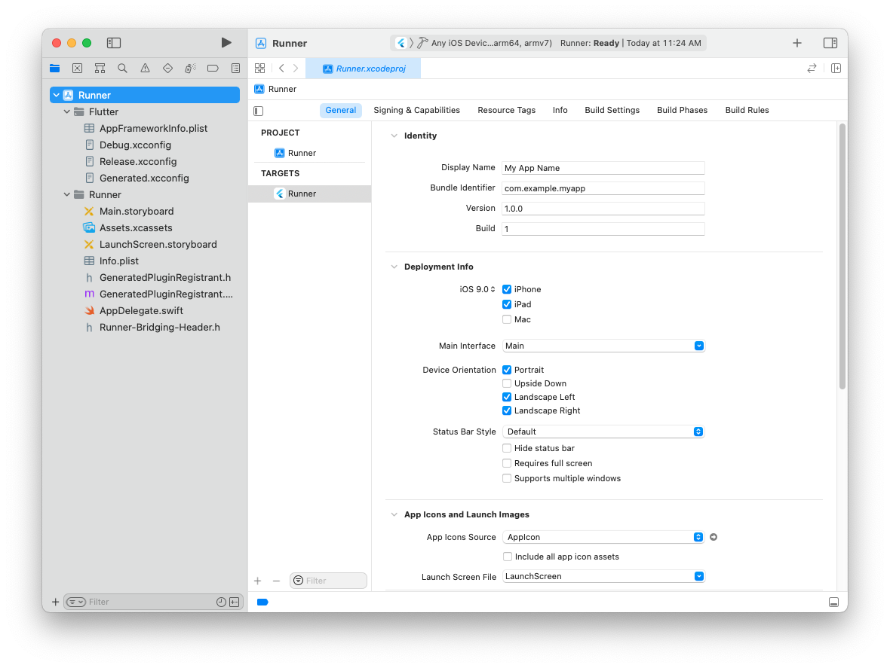
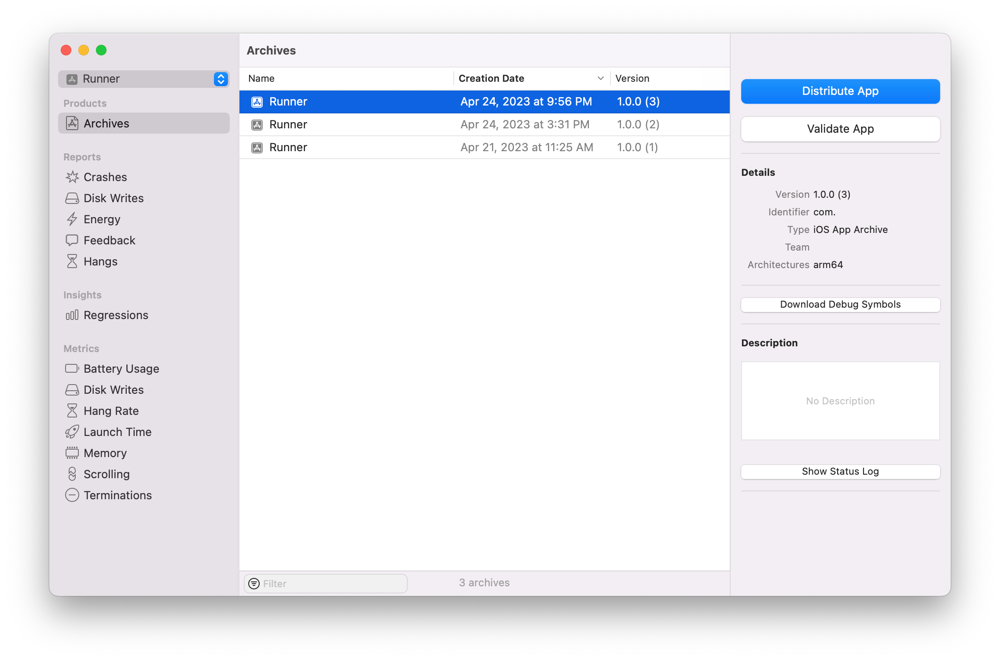

# Parkinson's Symptom Survey App Deployment Guide

<b>Note: This is the deployment guide for the Mobile App of the Parkinson's Project. Please ensure you have deployed the [AWS backend](https://github.com/UBC-CIC/parkinsons-backend/blob/main/docs/DeploymentGuide.md) before proceeding with this guide.</b>

| Index                                                      | Description                                               |
|:-----------------------------------------------------------|:----------------------------------------------------------| 
| [Dependencies](#Dependencies)                              | Required services and tools for deployment                                 |
| [Clone the Repository](#clone-the-repository)              | How to clone this repository                              |
| [Connect the App to API Gateway](#connect-the-app-to-api-gateway)| Connect the app to the backend of this project           |
| [Update the Survey (Optional)](#update-the-survey-optional)| Make changes to the survey content and ordering           |
| [Deploy to TestFlight](#deploy-to-testflight)              | Deploy your app to TestFlight for testers to use          |


## Dependencies
The full list of steps to create and deploy a new Flutter application from scratch can be found [here](https://docs.flutter.dev/get-started/install/macos).

 Below are the required tools and services to deploy the existing project from the GitHub repository:
 - [Apple Developer Account enrolled in the Apple Developer Program](https://developer.apple.com/programs/enroll/)
- [GitHub Account](https://github.com/)
- [Git](https://git-scm.com/) v2.14.1 or later
- [Flutter](https://docs.flutter.dev/get-started/install/macos#get-sdk) version 3.3 or higher
- IDE of your choice (For development we recommend: [Android Studio, version 2020.3.1 (Arctic Fox) or later](https://docs.flutter.dev/get-started/install/macos#install-android-studio))
- [Xcode](https://docs.flutter.dev/get-started/install/macos#install-xcode)
- [CocoaPods](https://guides.cocoapods.org/using/getting-started.html#installation) - Additionally, if you are installing on an Apple Silicon Mac, follow step 2 of [this section](https://docs.flutter.dev/get-started/install/macos#deploy-to-ios-devices)


## Clone The Repository

First, clone the github repository onto your machine. To do this:
1. Create an empty folder to contain the code.
2. Open terminal and **cd** into the newly created folder.
3. Clone the github repository by running the following command:
```
git clone git@github.com:UBC-CIC/parkinsons-survey-app.git
```

The code should now be copied into the new folder.


In terminal, **cd** into root directory of the project folder by running the following command from the newly created folder's directory:
```
cd parkinsons-survey-app/
```

## Connect the App to API Gateway

To connect the app to the API Gateway you created when deploying the backend:

1. Create a new Dart file in the **lib/** folder found in the root directory of the app project called **`backend_configuration.dart`**. Please ensure the name of the file is identical. 
2. Within this new file, you will need to enter two lines:
```
   1    final S3APIKey = '[YOUR_API_KEY]';
   2    final APIUrl = '[API_URL]/presigned-url';


```

Be sure to replace the `[YOUR_API_KEY]` and `[API_URL]`.

The `[YOUR_API_KEY]` should match the API key you generated and entered into AWS Secrets Manager when deploying the backend. If needed this key cn be viewed and retrieved from the AWS Secrets Manager console under `AWS Secrets Manager > Secrets > APIKey > Secret Value > Retrieve Secret Value`

The `[API_URL]` should correspond to the URL of the API Gateway you deployed. This URL can be found in the **AWS Console** in the **Amazon API Gateway Console** under **ParkinsonsAPI > Stages > prod > Invoke URL**. Be sure to append `'/presigned-url'`to the API Gateway URL as shown above.

**Ensure that this file is excluded from version control.**

## Update the Survey (Optional)

To update the survey symptom names or ordering open the [survey_json.json](../assets/survey_json.json) file located in the assets folder. 

Each page of the survey is represented by JSON object in the `"steps"` array of the JSON file. Surveys will need to start with an `"intro"` and `"end"` step in the same format as the existing JSON file. 

Custom multiple choice question pages can be created with the a JSON object in the following format: 

```
{
    "stepIdentifier": {
        "id": "4"
    },
    "type": "customQuestion",
    "title": "Which symptoms are you experiencing?",
    "text": "Multiple symptoms can be selected",
    "answerFormat": {
        "type": "multiple",
        "textChoices": [
            {
                "text": "Numbness",
                "value": "numbness"
            },
            {
                "text": "Sweating",
                "value": "sweating"
            },
            {
                "text": "Experience hot or cold",
                "value": "experience-hot-cold"
            },
            {
                "text": "Pain",
                "value": "pain"
            },
            {
                "text": "Aching",
                "value": "aching"
            }
        ]
    }
 },
```

The `"stepIdentifier"` should be unique from the other steps in the JSON file. 

The `"type"` should be set to `"customQuestion"` and `"answerFormat"` `"type"` should be set to `"multiple"` to create multiple choice questions with the 'None of the above' option. * 

Within the `"textChoices"`, the `"text"` represents the name of the symptom displayed in the app. The `"value"` represents the symptom name stored in the JSON and CSV files in the S3 buckets.


*NOTE: Alternative types of questions (ie) can be entered into this JSON file. These alternative question types should follow the JSON formats found in the [Flutter Survey Kit Library Example](https://pub.dev/packages/survey_kit/example). **However aditional changes in the [survey.dart file](../lib/survey.dart) will be required to format and save the survey results from alternative question types.**


## Deploy to TestFlight

To deploy your app to TestFlight, you must first register your app on App Store Connect.

The official guide to register your app can be found [here](https://docs.flutter.dev/deployment/ios#register-your-app-on-app-store-connect).


### Register a Bundle ID
1. To get started, sign in to [App Store Connect](https://appstoreconnect.apple.com/) with your Apple Developer account and open the [Identifiers Page](https://developer.apple.com/account/resources/identifiers/list).
2. Click **+** to create a new Bundle ID.
3. Select **App ID > App**
4. Enter a description (name for the Bundle ID) and an **Explicit** unique Bundle Id (e.g. **com.[organization name].parkinsonsApp**)
5. Find and select **Push Notifications** under **Capabilites** 
6. Leave the **App Services** as default and click **Continue>Register**

### Create an application record on App Store Connect
1. Now, in the [My Apps](https://appstoreconnect.apple.com/apps) page of App Store Connect, click **+** in the top left corner and select **New App**
2. Select **iOS** under **Platforms**
3. Enter a name for the app (e.g. **Balance Test App**)
4. Select the **Bundle ID** you have just created
5. Enter a unique ID for your app under **SKU** (e.g. **com.[organization name].parkinsonsApp**)
6. Select **Full Access** for **User Access** and click **Create**

### Beta Test Information
To start testing with TestFlight, fill out the **Beta App Information**  in the `General Information > Test Information` page of your app in App Store Connect.


### Update Xcode project settings
For an official guide, please view the **Update Xcode project settings** section of the page found [here](https://docs.flutter.dev/deployment/ios#review-xcode-project-settings).

1. Navigate to your project settings by running the following command from the root directory of your project
```
open ios/Runner.xcworkspace
```
2. Select the **Runner** with the App Store Connect icon in the Xcode navigator

3. In the **General** tab, choose a display name for the app
4. Under **Minimum Deployments**, ensure it is set to iOS 11.0
5. Head to the **Signing & Capabilities** tab and sign in with your Apple Developer account if have not done so already

5. Please **ENTER and VERIFY** the **Bundle Identifier** matches with the Bundle Id created in App Store Connect
6. In the **Signing & Capabilities** tab, ensure **Automatically manage signing** is checked and Team is set to the account/team associated with your Apple Developer account. Under Bundle Identifier, check that the Bundle Id matches with the Bundle Id created in App Store Connect

### Create a Build
1. In Xcode, in the General tab under Identity, check that the Version number is set to 1.0.0 and the Build number is set to 1 **for your first deployment**. For future deployments, increment the Version number and reset the Build number for major updates (e.g. 1.0.1+1). For minor updates, incrementing just the Build number is sufficient (e.g. 1.0.0+2). 
2. In your IDE, open the **pubspec.yaml** file located in the root directory of your project. Set the version and build number located near the top of the file to match with the version and build number of the current deployment and save the file:
```yaml
version: 1.0.0+1
```
3. In Xcode, set the Target to be: `Runner > Any iOS Device`

4. From the root directory of your project in **Terminal**, run:
```
flutter build ios
```
5. Once the Xcode build is complete, select `Product>Archive` in the Xcode menu bar. Wait for the archive to complete.
6. Once the archive has completed, a window should appear showing all of your archives. Select the most recent archive and click `Distribute App`

7. Select `App Store Connect > Upload > Strip Swift Symbols + Upload your app's symbols + Manage Version and Build Number > Automatically manage signing > Upload`

### Deploy to TestFlight

1. Once the Xcode upload is complete, navigate to your app page in App Store Connect. Under `Builds > iOS`, there should be a list of builds uploaded from Xcode. Builds may take a few minutes to appear here. 
2. Once the uploaded build appears, click on it, fill in the Test Details, and **add Testers by their Apple ID**
3. Once a tester is added, the app should be automatically submitted for review. The reviewing process could take a few days to process.
4. Once the build is processed, testers will recieve a code in their email for TestFlight.
5. Testers can then install TestFlight from the Apple App Store on an iPhone running iOS 13.0 or later and sign in with their Apple ID. 
6. In TestFlight, testers can press the `Redeem` button and enter the TestFlight code from their email. The app should then appear in TestFlight under Apps and testsers will be able to install the build.
7. Builds uploaded to TestFlight have a lifespan of 90 days and will expire after that. To create another build of the app to upload to TestFlight after the 90 day period, please follow the steps above to [create another build](#create-a-build) and [upload to TestFlight](#deploy-to-testflight-1).
