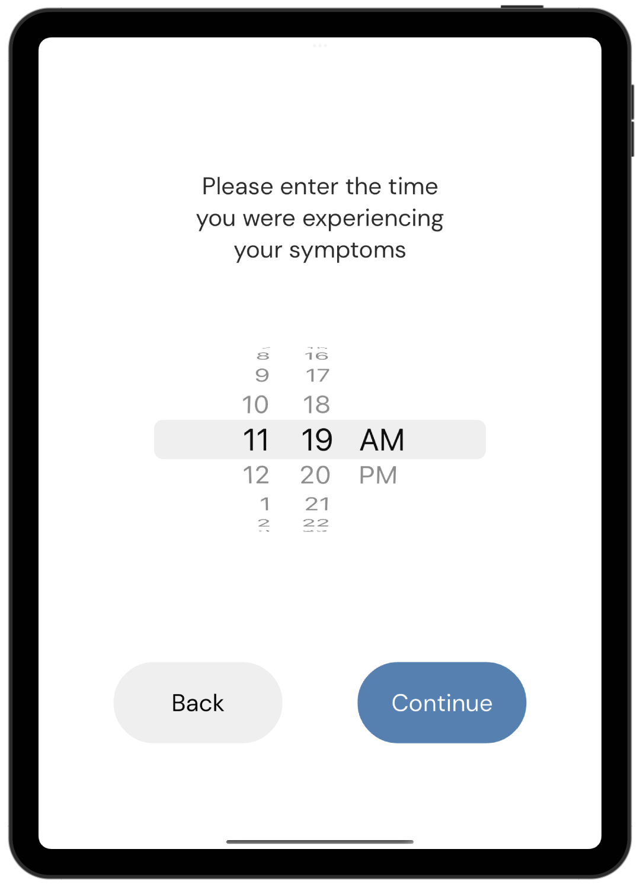

# Parkinson's Symptom Survey App User Guide

| Index                                                                    | Description                                 |
| :----------------------------------------------------------------------- | :------------------------------------------ |
| [Setting Up a Study](#setting-up-a-study)| How to set up and start a study         |
| [Patient Guide](#patient-guide)                                        | How to record symptoms and medication times                  |
| [Admin Page](#admin-page)                                          | How to edit edit the patient profile or end the trial                   |

## Setting Up A Study

### Filling out the IDs

|   |   |
|---|---|
|| When the app is first opened administrators will be able to enter the IDs corresponding to the study they will conduct. The "Trial ID" will be used to group the studies of each patient into the same "Trial" folder in storage. The "Wearbale Device ID" is the ID of the device that will be used to monitor the patient's health (i.e. Empatica Device ID). |
|| Administrators can select the frequency at which notifications are sent to the patient in the dropdown. If no notifications are needed, researchers can select **No Notifications** in the dropdown. Repeating notifications are started at the time the administrator starts the study.  |
|| **When the app is first installed, the default passcode will be set to 1234**. To set a new passcode, administrators can select the **Reset Passcode** button and enter a new passcode. |

To start the study, select the "Start Study" button. The app will navigate to the **Patient Home Page**.

**Note: Pauses in notifications at certain times or locations can be scheduled in the Apple Devie Settings in the *Focus* tab. More details can be found [here](https://support.apple.com/en-ca/HT204321#:~:text=Go%20to%20Settings%20%3E%20Focus.,while%20using%20a%20certain%20app.).**

## Patient Guide

|   |   |
|---|---|
|| When a patient first opens the app, the app will display the **Patient Home Page**. From this page, patients can record their symptoms or record their medication time. |

### Recording Symptoms

|   |   |
|---|---|
|| To record symptoms, patients can select the **Record Symptom** button. When pressed, the app will ask when the symptoms were expeienced.  |
|| If the **At a Previous Time** option is selected, patients will be able to select the time at which they experienced their symptoms. **The time corresponds to the date of the current day.** |
|| After the time at which the patient experienced their symptoms is confirmed, the app will navigate to the **Survey Start Page**. To start the survey, select the **Begin** button.  |
|| A set of four pages containing a total of 19 symptoms will be presented in the survey. Patients can select the symptoms they have experienced on each page or **None of the above** if they have not experienced any of the symptoms listed. To navigate through the survey, patients can select the **NEXT** button at the bottom to proceed to the next page, or the **back arrow** in the top-left corner to navigate to the previous page.|
|| Once the survey is completed, patients can select the **DONE** button to save their results and navigate back to the **Patient Home Page**.|

### Recording Medication Times

|   |   |
|---|---|
|| To record Parkinson's medication intake times, patients can select the **Record Medication Time** button in the **Patient Home Page**. When pressed, the app will ask when the medication was taken.  |
|| If the **At a Previous Time** option is selected, patients will be able to select the time at which they took their Parkinson's medication. **The time corresponds to the date of the current day.** |
|| After the time at which the patient took their medication is selected, patients will be prompted to confirm the time at which they took their medication. Patients can select **No** to edit the time, or **Yes** to confirm and record the medication time.  |

## Admin Page

|   |   |
|---|---|
|| Administrators can access the admin page by pressing the settings button in the top-right corner of the admin page. |
|| Administrators will need to enter the passcode set in the **Study Setup** page to unlock the admin page. |
|| In the admin page, administrators can edit the IDs or notification frequency of the current study. To save the changes, select the **Save** button which will be highilighted in blue when changes are made.  |

### Ending a Study
|   |   |
|---|---|
| | To end a study, administrators can select the **End Study** button. A warning will appear and adminstrators can select **Yes** to proceed with the action or **No** to go back. |
| | If **Yes** is selected, the app will attempt to upload the study results and end the study. If it is succesful, a checkmark will appear on the screen and the app will reset all settings and navigate to the setup page. If the upload is unsuccessful, an **X** will appear on the screen. |
